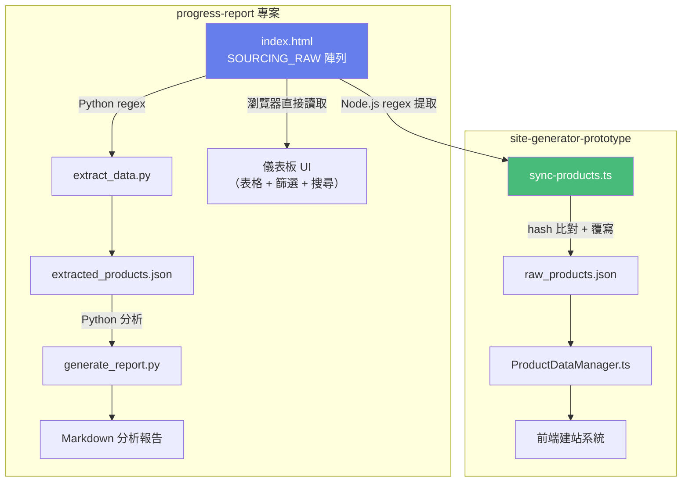
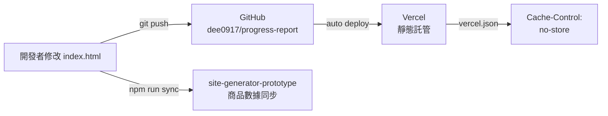

# ARCHITECTURE.md — 進度報告專案架構說明

## 目錄結構

```
progress-report/
├── index.html                  # 主應用程式（UI + 數據 + 邏輯，618KB）
├── extract_data.py             # Python: 從 HTML 提取 SOURCING_RAW → JSON
├── generate_report.py          # Python: 從 JSON 生成 Markdown 報告
├── extracted_products.json     # 提取後的商品 JSON（103KB，20 分類 412 品）
├── vercel.json                 # Vercel 部署配置（cache-control headers）
├── manifest.json               # PWA 清單檔
├── icon-192.png                # PWA 圖標 192x192
├── icon-512.png                # PWA 圖標 512x512
├── preview_v2.7_design.html    # v2.7 設計預覽稿
├── .env.local                  # 環境變數（不入版控）
├── .gitignore                  # Git 忽略規則
├── .vercel/                    # Vercel CLI 本地配置
├── CLAUDE.md                   # 開發指南
├── HANDOVER.md                 # 交接文件
└── ARCHITECTURE.md             # 本文件
```

---

## index.html 結構佈局

單一 HTML 檔案內的邏輯分區（按行號）：

| 行範圍 | 區塊 | 說明 |
|---|---|---|
| 1-41 | `<head>` 設定 | meta、字體、TailwindCSS、SW 清理 |
| 42-200 | `<style>` | 自定義 CSS（動畫、漸層、卡片效果） |
| 200-830 | `<body>` HTML | 儀表板 UI 標記（Tab、表格、卡片） |
| ~833-4400 | `SOURCING_RAW` | 商品主數據陣列（20 分類） |
| 4400-4668 | `<script>` | UI 互動邏輯（切換 Tab、篩選、搜尋） |

---

## 數據流向圖



---

## 商品分類清單

```mermaid
graph LR
    subgraph "20 個商品分類"
        direction TB
        C1["1. Traditional Feng Shui Talismans"]
        C2["2. Smudging & Incense"]
        C3["3. Crystals & Stones"]
        C4["4. Sound Healing Tools"]
        C5["5. Sacred Symbols"]
        C6["6. Desk Feng Shui"]
        C7["7. Omamori & Sachets"]
        C8["8. Crystal Hangings"]
        C9["9. Herbal Bottles"]
        C10["10. Energy Cards"]
        C11["11. Everyday Carry"]
        C12["12. Minimalist Desk Setup"]
        C13["13. Coffee & Tea Ritual"]
        C14["14. Creator Tools"]
        C15["15. Smart Accessories"]
        C16["16. Aromatherapy"]
        C17["17. Premium Stationery"]
        C18["18. Ultralight Camping"]
        C19["19. Organization"]
        C20["20. Car Accessories"]
    end
```



---

## 部署架構



---

## 關鍵函數索引

> 以下函數皆定義在 `index.html` 的 `<script>` 區塊內

| 函數 | 用途 |
|---|---|
| `renderTable()` | 渲染商品表格（含篩選和排序） |
| `filterByCategory()` | 按分類篩選商品 |
| `searchProducts()` | 關鍵字搜尋 |
| `calculatePricing()` | 多幣種價格換算 |
| `updateStats()` | 更新儀表板統計數據 |
| `exportData()` | 匯出數據功能 |
| `initTabs()` | 初始化分頁切換 |
